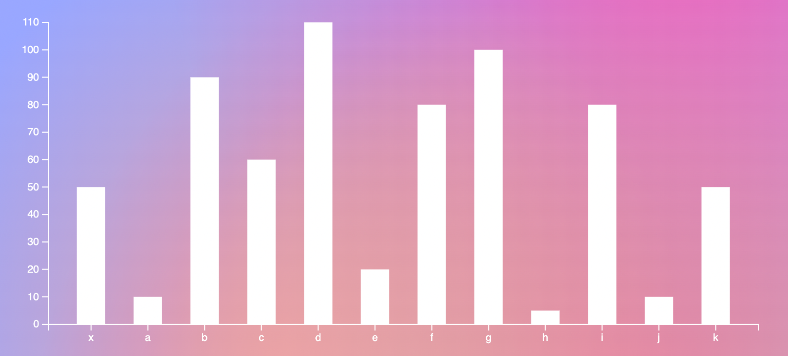

# A Next.js + D3 Starter!

[live](https://felixbuchholz.github.io/next-d3-starter/)

*Integrates D3 and React following a D3 first approach:*

- DOM is mostly handled by D3.
- Static properties are styled with CSS.
- Transitions are done by D3
- Resizes Charts based on the D3 margins convention.
- Partially tested with Jest and testing-library.